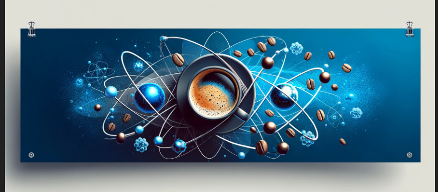

<h1 align="center" class="Merriweather">Welcome to Liebniz's coding space</h1>
<table>
  <tr>
    <td valign="top">
 
    
👋 My name is Anders and I love programming 

     
    
👨‍🎓 Right now, I am doing an internship at <a href="sprinta.se">Sprinta</a>

     
    Primaries
    <ul>
      <li type="i"> Java (Spring Boot, Maven)
      <li type="i"> React (styled-components)
    </ul>
        Secondaries
    <ul>
      <li type="i"> MySQL
    </ul>
  
</td>
    <td valign="top"></td>
  </tr>
</table>
